# Détection de Spams — Classification Binaire avec Orange Data Mining

## Contexte

Projet de Data Mining réalisé dans le cadre d'un examen. L'objectif est de classifier automatiquement des emails comme **Spam** ou **Non_Spam** à l'aide d'Orange Data Mining, en comparant plusieurs algorithmes de machine learning.

## Données

- **Source** : Base de données Hewlett-Packard Labs (Spambase)
- **Taille** : 4 601 emails
- **Variables** : 57 variables continues (fréquences de mots et caractères)
- **Répartition** : 2 788 Non_Spam (60.6%) / 1 813 Spam (39.4%)

## Workflow Orange

Le fichier `exam.ows` contient le workflow complet :

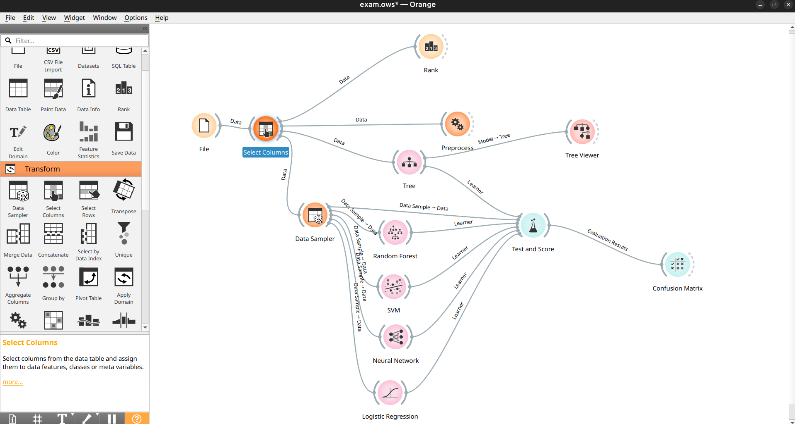

**Composants principaux** :

| Étape | Widget | Rôle |
|-------|--------|------|
| Chargement | File | Import du dataset |
| Sélection | Select Columns | Exclusion de la variable "Numero" |
| Prétraitement | Preprocess | Normalisation Z-score |
| Échantillonnage | Data Sampler | Split 66/34, stratifié |
| Modélisation | Tree, Random Forest, SVM, Neural Network, Logistic Regression | Entraînement des classifieurs |
| Évaluation | Test and Score | Cross-validation 10 folds stratifiée |
| Analyse | Confusion Matrix, Rank | Matrices de confusion et importance des variables |

## Exploration des données

### Distribution des classes

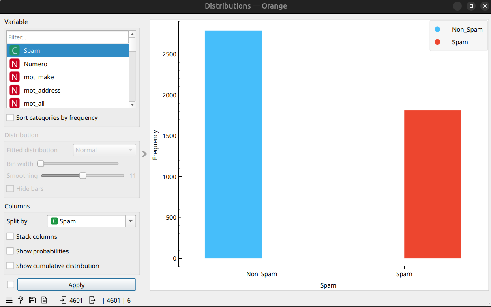

Le dataset présente un déséquilibre modéré (ratio 60/40). La stratification lors de la division train/test est essentielle pour maintenir cette proportion.

### Box Plot

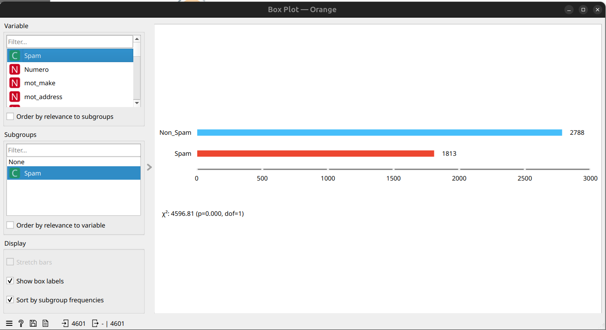

Le test du chi carré (χ² = 4596.81, p = 0.000) confirme que les classes sont significativement différentes.

---

## Problème identifié : Data Leakage

### Résultats initiaux (AVANT correction)

Les premiers résultats affichaient des accuracy de 99–100%, ce qui est anormalement élevé :

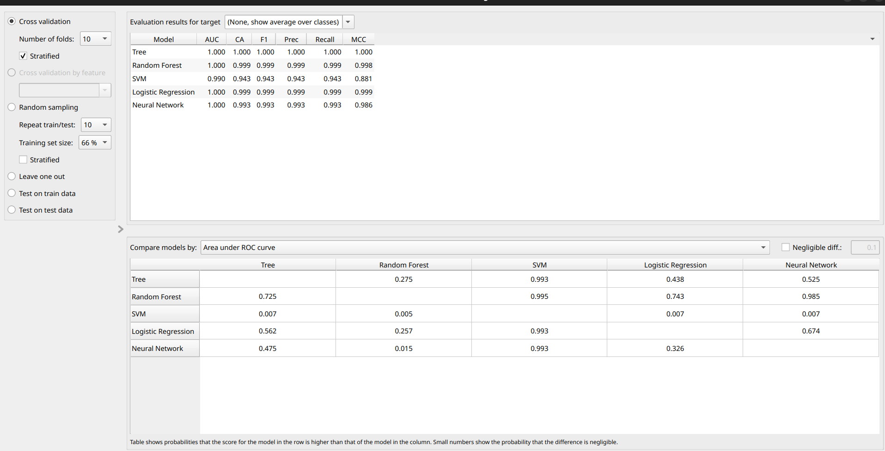

| Modèle | AUC | Accuracy | F1 | Precision | Recall |
|--------|-----|----------|----|-----------|--------|
| Tree | 1.000 | 100.0% | 1.000 | 1.000 | 1.000 |
| Random Forest | 1.000 | 99.9% | 0.999 | 0.999 | 0.999 |
| Logistic Regression | 1.000 | 99.9% | 0.999 | 0.999 | 0.999 |
| Neural Network | 1.000 | 99.3% | 0.993 | 0.993 | 0.993 |
| SVM | 0.990 | 94.3% | 0.943 | 0.943 | 0.943 |

### Identification de la cause : variable "Numero"

Le widget **Rank** a révélé que `Numero` (simple identifiant de ligne) dominait le classement avec un Information Gain de 0.722 :

Cette variable est un compteur séquentiel sans aucune relation causale avec le contenu des emails. Le modèle mémorisait les numéros au lieu d'apprendre les vrais patterns.

### Matrices de confusion AVANT correction

#### Tree — 1 seule erreur sur 4 601
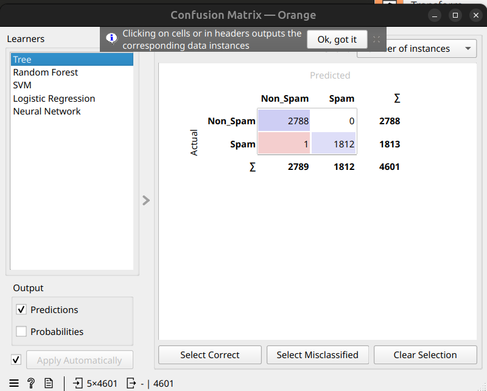

#### Random Forest — 5 erreurs
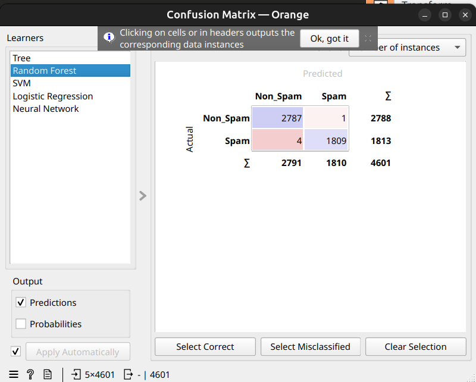

#### SVM — 264 erreurs
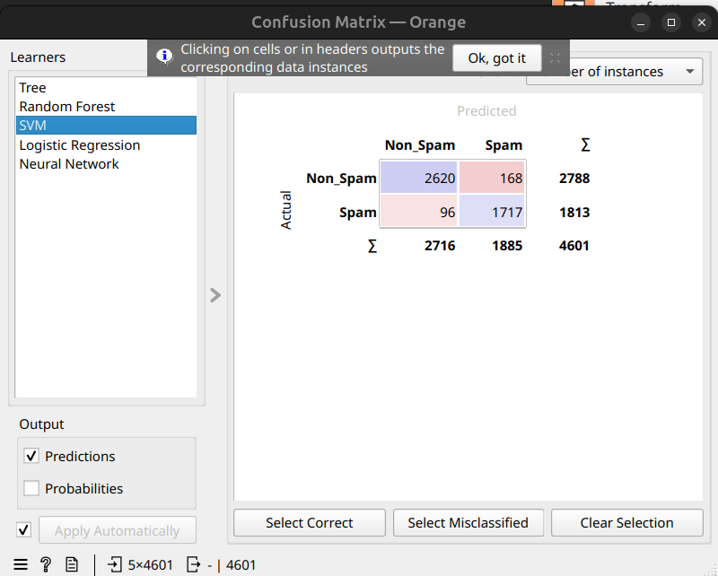

#### Logistic Regression — 3 erreurs
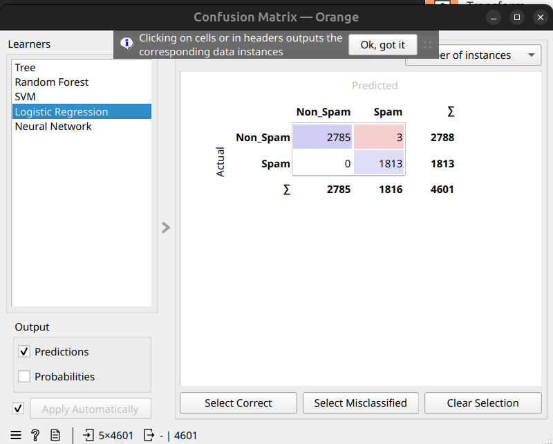

#### Neural Network — 30 erreurs
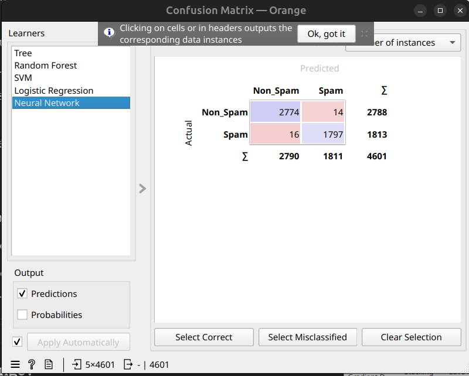

> Tree avec 1 seule erreur et Random Forest avec 5 erreurs sont clairement en sur-apprentissage dû à la variable `Numero`.

---

## Correction du Data Leakage

**Action** : exclusion de `Numero` via le widget **Select Columns** (déplacement dans la zone *Ignored*).

**Pourquoi** :
- `Numero` n'a aucune relation causale avec le spam
- Un modèle entraîné avec `Numero` ne peut pas généraliser à de nouveaux emails
- Les résultats mesuraient la capacité de mémorisation, pas la capacité de détection

---

## Résultats APRÈS correction

### Test and Score corrigé

| Modèle | AUC | Accuracy | F1 | Precision | Recall | MCC |
|--------|-----|----------|----|-----------|--------|-----|
| **Neural Network** | 0.980 | **94.0%** | 0.940 | 0.940 | 0.940 | 0.875 |
| **Random Forest** | 0.981 | **93.9%** | 0.939 | 0.939 | 0.939 | 0.871 |
| Logistic Regression | 0.972 | 92.9% | 0.929 | 0.929 | 0.929 | 0.851 |
| Tree | 0.906 | 92.4% | 0.924 | 0.924 | 0.924 | 0.841 |
| SVM | 0.747 | 63.3% | 0.634 | 0.686 | 0.633 | 0.317 |

### Matrices de confusion APRÈS correction

#### Neural Network (94.0%)
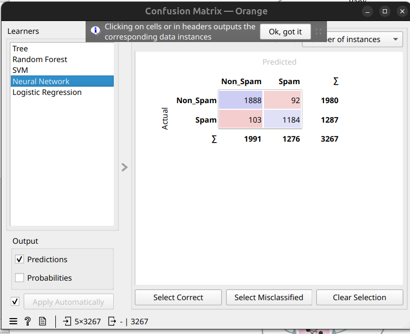

| | Prédit Non_Spam | Prédit Spam |
|---|---|---|
| **Réel Non_Spam** | 1 888 (TN) | 92 (FP) |
| **Réel Spam** | 103 (FN) | 1 184 (TP) |

- Taux de Faux Positifs : 4.6%
- Taux de Faux Négatifs : 8.0%

#### Random Forest (93.9%) — Modèle RECOMMANDÉ
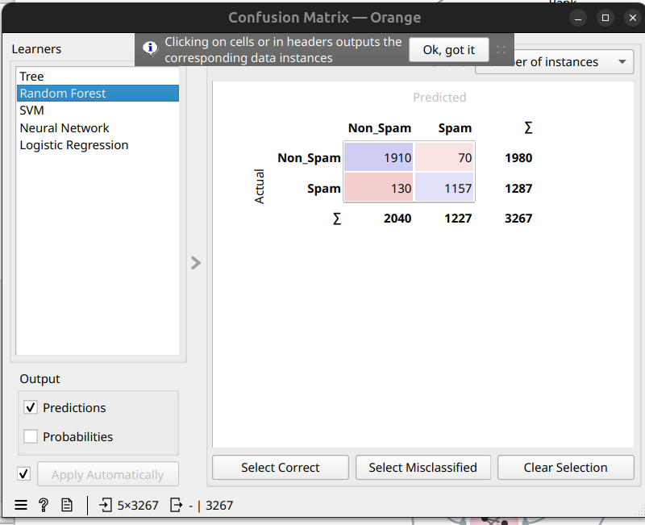

| | Prédit Non_Spam | Prédit Spam |
|---|---|---|
| **Réel Non_Spam** | 1 910 (TN) | 70 (FP) |
| **Réel Spam** | 130 (FN) | 1 157 (TP) |

- Taux de Faux Positifs : **3.5%** (meilleur score)
- Taux de Faux Négatifs : 10.1%

#### Logistic Regression (92.9%)
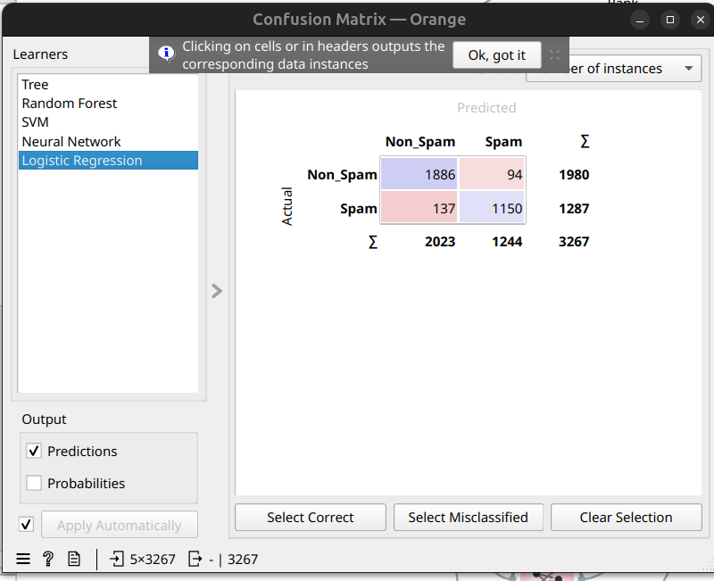

| | Prédit Non_Spam | Prédit Spam |
|---|---|---|
| **Réel Non_Spam** | 1 886 (TN) | 94 (FP) |
| **Réel Spam** | 137 (FN) | 1 150 (TP) |

#### Tree (92.4%)
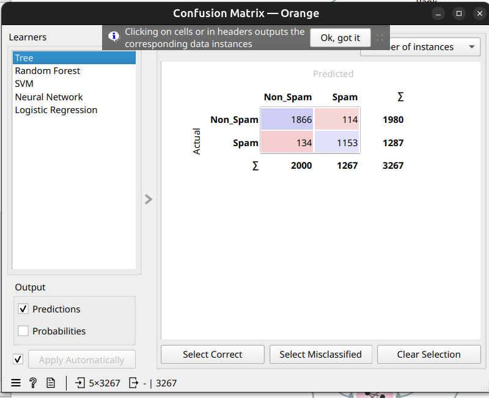

| | Prédit Non_Spam | Prédit Spam |
|---|---|---|
| **Réel Non_Spam** | 1 866 (TN) | 114 (FP) |
| **Réel Spam** | 134 (FN) | 1 153 (TP) |

#### SVM (63.3%) — Performance insuffisante
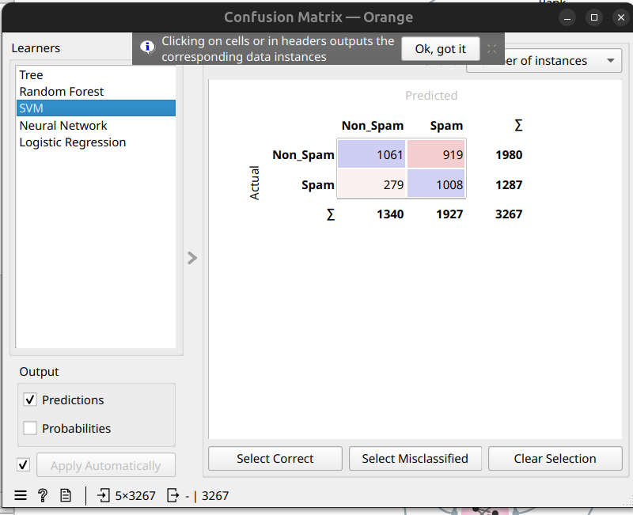

| | Prédit Non_Spam | Prédit Spam |
|---|---|---|
| **Réel Non_Spam** | 1 061 (TN) | 919 (FP) |
| **Réel Spam** | 279 (FN) | 1 008 (TP) |

> SVM classe 919 bons emails comme spam (46.4% de FP) — totalement inacceptable.

---

## Comparaison Avant / Après

| Modèle | AVANT | APRÈS | Différence |
|--------|-------|-------|------------|
| Tree | 100.0% | 92.4% | -7.6% |
| Random Forest | 99.9% | 93.9% | -6.0% |
| Logistic Regression | 99.9% | 92.9% | -7.0% |
| Neural Network | 99.3% | 94.0% | -5.3% |
| SVM | 94.3% | 63.3% | -31.0% |

La baisse d'accuracy n'est pas un problème — c'est un signe de santé. Elle indique que le modèle apprend à partir de signaux réels et généralisables.

---

## Analyse des erreurs

Dans un filtre anti-spam, les **faux positifs** (bon email classé spam) sont plus critiques que les faux négatifs, car l'utilisateur risque de manquer un email important.

| Modèle | Faux Positifs | Faux Négatifs | Verdict |
|--------|--------------|---------------|---------|
| Random Forest | 70 (3.5%) | 130 (10.1%) | ✅ Excellent FP |
| Neural Network | 92 (4.6%) | 103 (8.0%) | ✅ Équilibré |
| Logistic Regression | 94 (4.7%) | 137 (10.6%) | ✅ Bon FP |
| Tree | 114 (5.8%) | 134 (10.4%) | ⚠️ Acceptable |
| SVM | 919 (46.4%) | 279 (21.7%) | ❌ Catastrophique |

## Modèle recommandé

**Random Forest** — avec 93.9% d'accuracy et seulement **3.5% de faux positifs**, il offre le meilleur compromis entre performance globale et minimisation des erreurs critiques.

## Reproductibilité

- **Random seed** : 42
- **Cross-validation** : 10 folds, stratifiée
- **Normalisation** : Z-score
- **Split** : 66% train / 34% test, stratifié
- **Outil** : Orange Data Mining (fichier `exam.ows`)

## Conclusion

Ce projet illustre l'importance de la rigueur méthodologique en data mining. La détection et la correction du data leakage (variable `Numero`) ont permis de passer de résultats artificiellement parfaits à des performances réalistes et déployables. Le processus itératif **détection → diagnostic → correction → validation** est au cœur de toute démarche de data science fiable.